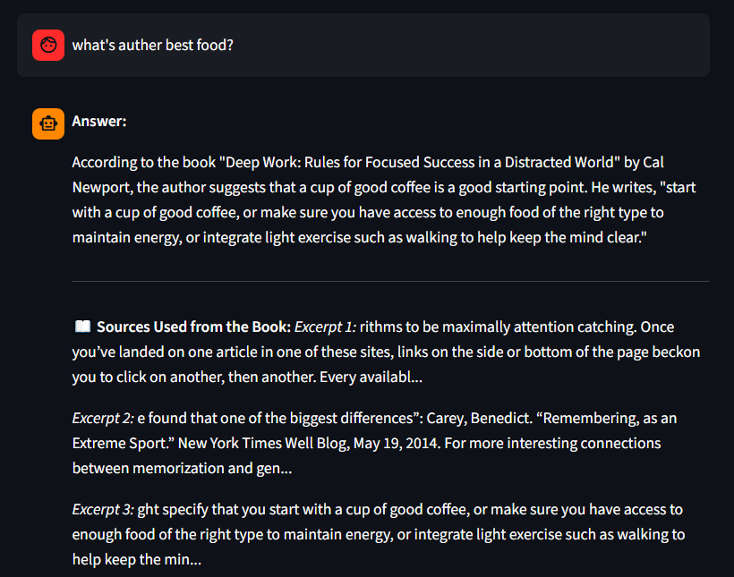

# deep-work-coauch
It's is a ai conversation system, where you can learn particular concept from the book.
And ask for query if confuse about certain things.

---

### 🧠 The Problem vs. The Solution

**The Problem:** It's too old method to read whole book to understand a particular concept that we wanted to understand.

**Solution:** I am presenting Retrieval-Augmented Generation it only read the information from that book that is needed. And user feel one and one converstation.
Also you could ask questions from ai, I believe real learning happen when you ask questions.

---

**Project building process:**
Fist we take a book then split it in many chunks. 
Then make those chunks book's embedding.
Then we compare our book's embedding with user's embedding.
Then we find the exact match using query in database of vector space.
Then we return 3 accociated chunks.
Then we make custom prompt with user query and with book's chunks for ai to read and reply.

So, that's the work flow, then use api for server connection with frontend.

### ⚙️ Tech Stack

*   **Language:**  
    The core programming language used for the backend and AI logic.
*   **Web Framework:**  
    Used to build the fast, modern API endpoints (`/chat`).
*   **ASGI Server:**  
    The lightning-fast server that runs the FastAPI application.
*   **Local AI Engine:**  
    Serves the AI models locally on the machine. No external API keys required!
    *   *LLM Model:* `llama3.2:1b` (Generates the final conversational responses).
    *   *Embedding Model:* `nomic-embed-text` (Converts text into numerical vectors).
*   **Vector Database:**  
    A local, persistent vector store used to save book chunks and perform fast semantic similarity searches.
*   **Document Processing:**  (`fitz`) 
    A high-performance library used to rapidly extract text from the `deep_work.pdf` file.
*   **Data Validation:**  
    Ensures the data coming into the API (like the user's question) is correctly formatted.

